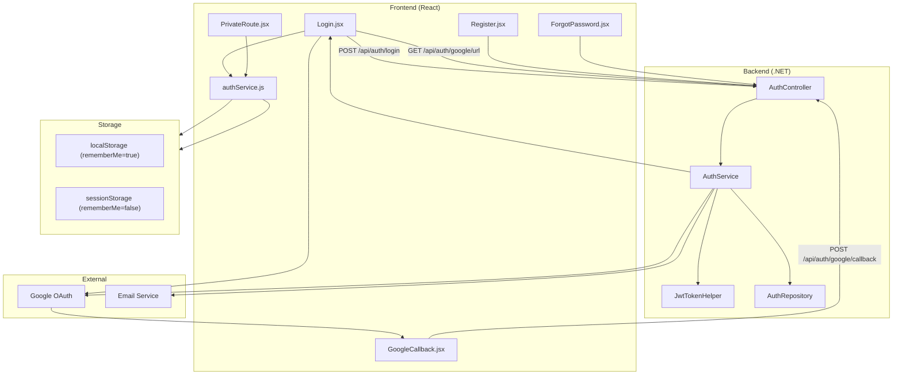
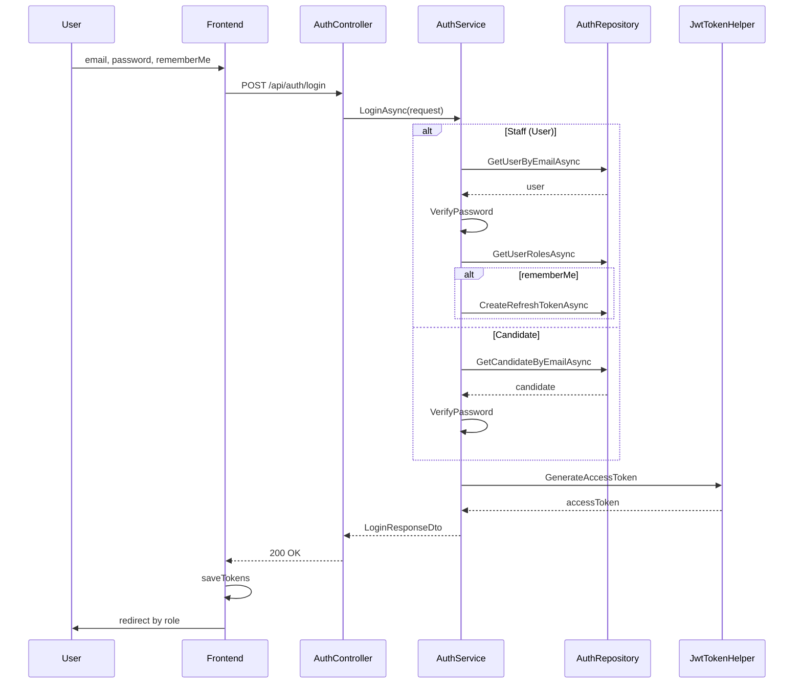
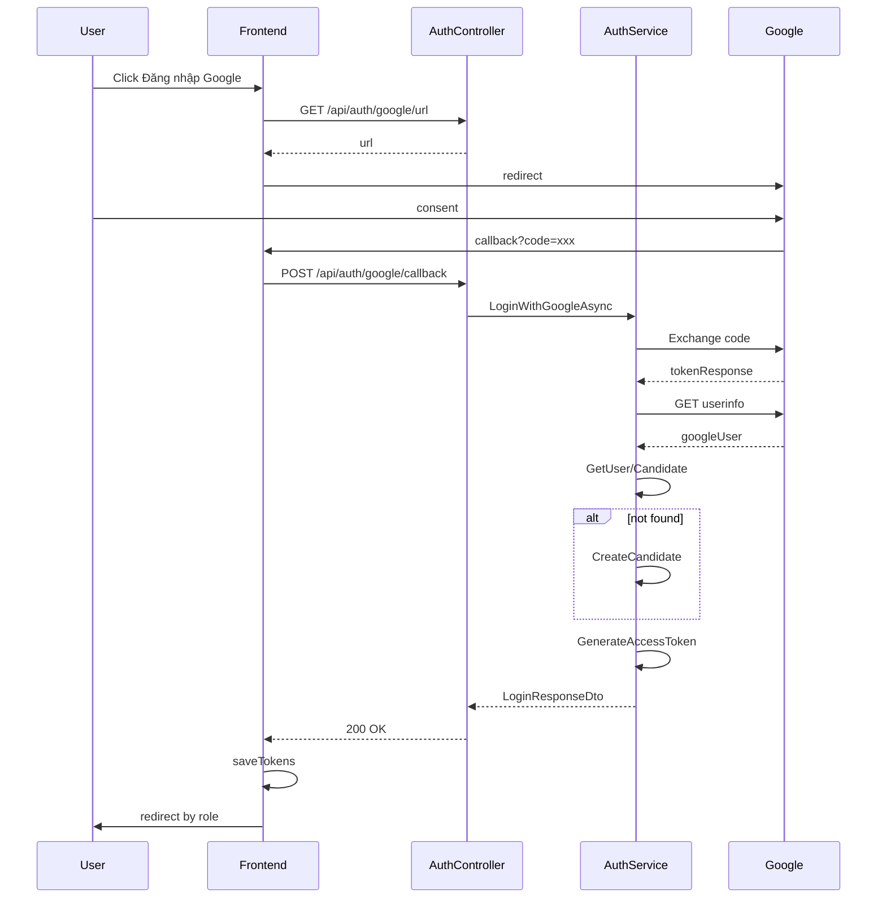
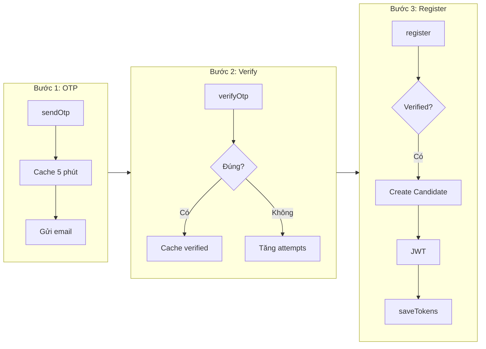
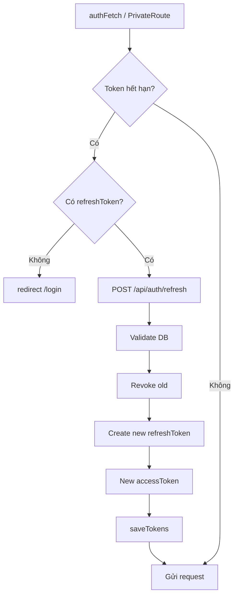
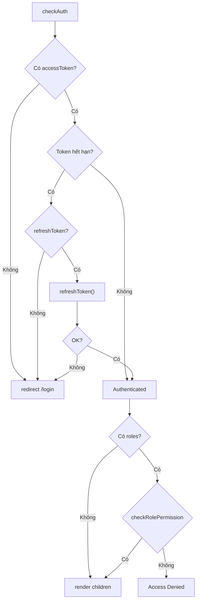
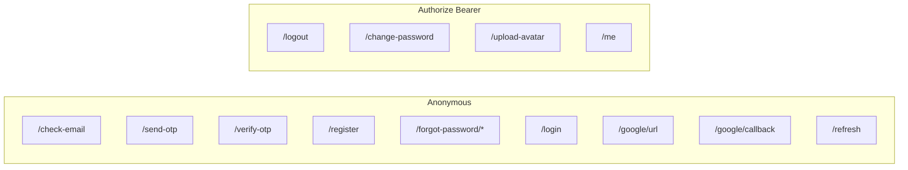

# RMS - Mermaid Code (Copy để chạy trên app)

## Cách sử dụng
- **Mermaid Live Editor:** https://mermaid.live → paste code vào
- **VS Code:** Cài extension "Mermaid" hoặc "Markdown Preview Mermaid Support"
- **Trình duyệt:** Mở file `auth-workflow-mermaid.html` trong thư mục này

---

## 1. Tổng quan Auth Flow

---

## 2. Login Flow (Sequence)

---

## 3. Google OAuth Flow

---

## 4. Register Flow

---

## 5. Refresh Token Flow

---

## 6. Route Protection (PrivateRoute)

---

## 7. API Auth Endpoints

