# Offer Management System - Use Case Diagram

## Use Case Information for Diagram Creation

### **Actors (Người dùng)**

1. **HR Staff** - Nhân viên HR
2. **HR Manager** - Quản lý HR  
3. **Director** - Giám đốc
4. **Candidate** - Ứng viên
5. **System** - Hệ thống (cho các tác vụ tự động)

### **Use Cases by Actor**

## **HR Staff Use Cases**

### **Offer Management**
- **Create Offer** - Tạo thư mời mới
- **Update Offer Details** - Cập nhật thông tin offer (salary, benefits, start date)
- **Submit Offer for Review** - Gửi offer để HR Manager duyệt
- **Send Approved Offer** - Gửi offer đã được duyệt cho ứng viên
- **View All Offers** - Xem danh sách tất cả offers
- **View Offer Details** - Xem chi tiết một offer

### **Negotiation Management**
- **Handle Offer Negotiation** - Xử lý đàm phán từ ứng viên
- **Update Offer After Negotiation** - Cập nhật offer sau đàm phán
- **Save Negotiation Changes** - Lưu thay đổi trong quá trình đàm phán
- **Resend Updated Offer** - Gửi lại offer đã cập nhật

### **Accepted Offers Management**
- **View Accepted Offers** - Xem offers đã được ứng viên chấp nhận
- **Send Accepted Offers to Manager** - Gửi danh sách offers đã chấp nhận cho HR Manager

### **Reporting**
- **View Offer Statistics** - Xem thống kê offers
- **Generate Offer Reports** - Tạo báo cáo offers

## **HR Manager Use Cases**

### **All HR Staff Use Cases** (Inheritance)
- Tất cả use cases của HR Staff

### **Approval Management**
- **Review Pending Offers** - Xem xét offers chờ duyệt
- **Approve Offer** - Phê duyệt offer
- **Reject Offer** - Từ chối offer
- **Forward Offer to Director** - Chuyển offer cho Director duyệt

### **Advanced Management**
- **View Accepted Offers from Staff** - Xem offers đã chấp nhận được Staff gửi lên
- **Manage Negotiation Workflow** - Quản lý quy trình đàm phán
- **Review Offer Edit History** - Xem lịch sử chỉnh sửa offers

### **Analytics & Reporting**
- **View Advanced Analytics** - Xem phân tích nâng cao
- **Monitor Offer Performance** - Theo dõi hiệu suất offers
- **Generate Management Reports** - Tạo báo cáo quản lý

## **Director Use Cases**

### **High-Level Approval**
- **View Pending Director Approvals** - Xem offers chờ Director duyệt
- **Approve High-Value Offer** - Phê duyệt offers cao cấp
- **Reject High-Value Offer** - Từ chối offers cao cấp
- **View Offer Approval History** - Xem lịch sử phê duyệt

### **Strategic Oversight**
- **View Recruitment Statistics** - Xem thống kê tuyển dụng
- **Monitor Approval Workflow** - Theo dõi quy trình phê duyệt
- **Review Offer Trends** - Xem xu hướng offers

## **Candidate Use Cases**

### **Offer Management**
- **View My Offers** - Xem các offers của tôi
- **View Offer Details** - Xem chi tiết offer
- **Accept Offer** - Chấp nhận offer
- **Decline Offer** - Từ chối offer
- **Request Negotiation** - Yêu cầu đàm phán offer
- **Respond to Updated Offer** - Phản hồi offer đã cập nhật

### **Communication**
- **Add Comments to Offer** - Thêm bình luận vào offer
- **Track Offer Status** - Theo dõi trạng thái offer

## **System Use Cases (Automated)**

### **Notifications**
- **Send Offer Notification Email** - Gửi email thông báo offer
- **Send Approval Notification** - Gửi thông báo phê duyệt
- **Send Status Change Notification** - Gửi thông báo thay đổi trạng thái

### **Workflow Automation**
- **Auto-send After Director Approval** - Tự động gửi sau khi Director duyệt
- **Update Offer Status** - Cập nhật trạng thái offer
- **Log Status Changes** - Ghi log thay đổi trạng thái
- **Validate Business Rules** - Kiểm tra quy tắc nghiệp vụ

### **Data Management**
- **Create Audit Trail** - Tạo audit trail
- **Archive Completed Offers** - Lưu trữ offers đã hoàn thành
- **Generate Analytics Data** - Tạo dữ liệu phân tích

## **Use Case Relationships**

### **Include Relationships**
- **Create Offer** includes **Validate Candidate Information**
- **Send Offer** includes **Send Offer Notification Email**
- **Approve Offer** includes **Update Offer Status**
- **Handle Negotiation** includes **Create Audit Trail**

### **Extend Relationships**
- **Create Offer** extends **Create Offer from Application**
- **Update Offer** extends **Update Offer with File Attachments**
- **Send Offer** extends **Schedule Offer Delivery**

### **Generalization Relationships**
- **HR Manager** generalizes **HR Staff** (inheritance of all HR Staff use cases)

## **Mermaid Use Case Diagram**

```mermaid
graph TB
    %% Actors
    HRStaff[HR Staff]
    HRManager[HR Manager]
    Director[Director]
    Candidate[Candidate]
    System[System]

    %% HR Staff Use Cases
    CreateOffer[Create Offer]
    UpdateOffer[Update Offer Details]
    SubmitReview[Submit Offer for Review]
    SendOffer[Send Approved Offer]
    ViewOffers[View All Offers]
    ViewOfferDetails[View Offer Details]
    HandleNegotiation[Handle Offer Negotiation]
    UpdateAfterNegotiation[Update Offer After Negotiation]
    ViewAcceptedOffers[View Accepted Offers]
    SendToManager[Send Accepted Offers to Manager]

    %% HR Manager Use Cases
    ReviewPending[Review Pending Offers]
    ApproveOffer[Approve Offer]
    RejectOffer[Reject Offer]
    ForwardToDirector[Forward Offer to Director]
    ViewAcceptedFromStaff[View Accepted Offers from Staff]
    ViewAdvancedAnalytics[View Advanced Analytics]

    %% Director Use Cases
    ViewDirectorPending[View Pending Director Approvals]
    ApproveHighValue[Approve High-Value Offer]
    RejectHighValue[Reject High-Value Offer]
    ViewApprovalHistory[View Offer Approval History]
    ViewRecruitmentStats[View Recruitment Statistics]

    %% Candidate Use Cases
    ViewMyOffers[View My Offers]
    ViewCandidateOfferDetails[View Offer Details]
    AcceptOffer[Accept Offer]
    DeclineOffer[Decline Offer]
    RequestNegotiation[Request Negotiation]
    RespondToUpdated[Respond to Updated Offer]
    AddComments[Add Comments to Offer]

    %% System Use Cases
    SendNotificationEmail[Send Offer Notification Email]
    SendApprovalNotification[Send Approval Notification]
    AutoSendAfterApproval[Auto-send After Director Approval]
    UpdateOfferStatus[Update Offer Status]
    CreateAuditTrail[Create Audit Trail]
    ValidateBusinessRules[Validate Business Rules]

    %% Connections - HR Staff
    HRStaff --> CreateOffer
    HRStaff --> UpdateOffer
    HRStaff --> SubmitReview
    HRStaff --> SendOffer
    HRStaff --> ViewOffers
    HRStaff --> ViewOfferDetails
    HRStaff --> HandleNegotiation
    HRStaff --> UpdateAfterNegotiation
    HRStaff --> ViewAcceptedOffers
    HRStaff --> SendToManager

    %% Connections - HR Manager (includes all HR Staff + additional)
    HRManager --> CreateOffer
    HRManager --> UpdateOffer
    HRManager --> SubmitReview
    HRManager --> SendOffer
    HRManager --> ViewOffers
    HRManager --> ViewOfferDetails
    HRManager --> HandleNegotiation
    HRManager --> UpdateAfterNegotiation
    HRManager --> ViewAcceptedOffers
    HRManager --> SendToManager
    HRManager --> ReviewPending
    HRManager --> ApproveOffer
    HRManager --> RejectOffer
    HRManager --> ForwardToDirector
    HRManager --> ViewAcceptedFromStaff
    HRManager --> ViewAdvancedAnalytics

    %% Connections - Director
    Director --> ViewDirectorPending
    Director --> ApproveHighValue
    Director --> RejectHighValue
    Director --> ViewApprovalHistory
    Director --> ViewRecruitmentStats

    %% Connections - Candidate
    Candidate --> ViewMyOffers
    Candidate --> ViewCandidateOfferDetails
    Candidate --> AcceptOffer
    Candidate --> DeclineOffer
    Candidate --> RequestNegotiation
    Candidate --> RespondToUpdated
    Candidate --> AddComments

    %% Connections - System
    System --> SendNotificationEmail
    System --> SendApprovalNotification
    System --> AutoSendAfterApproval
    System --> UpdateOfferStatus
    System --> CreateAuditTrail
    System --> ValidateBusinessRules

    %% Include Relationships
    CreateOffer -.->|includes| ValidateBusinessRules
    SendOffer -.->|includes| SendNotificationEmail
    ApproveOffer -.->|includes| UpdateOfferStatus
    HandleNegotiation -.->|includes| CreateAuditTrail
    AcceptOffer -.->|includes| UpdateOfferStatus
    DeclineOffer -.->|includes| UpdateOfferStatus
    RequestNegotiation -.->|includes| UpdateOfferStatus
```

## **Use Case Priorities**

### **High Priority (Core Functionality)**
1. Create Offer
2. Approve/Reject Offer
3. Send Offer to Candidate
4. Candidate Respond to Offer
5. Handle Offer Negotiation

### **Medium Priority (Management Features)**
1. View Offer Statistics
2. Forward to Director
3. Manage Accepted Offers
4. View Offer History

### **Low Priority (Advanced Features)**
1. Advanced Analytics
2. Automated Notifications
3. Bulk Operations
4. Report Generation

## **Business Rules in Use Cases**

1. **Authorization Rules**
   - Only HR Staff/Manager can create offers
   - Only HR Manager can approve offers
   - Only Director can approve high-value offers
   - Only Candidates can respond to their own offers

2. **Workflow Rules**
   - Offers must be approved before sending
   - Negotiation requires offer to be in SENT status
   - Director approval auto-sends offer
   - Only one active offer per application

3. **Data Validation Rules**
   - Salary must be within budget range
   - Start date must be future date
   - Required fields must be filled
   - Email format validation

4. **Audit Rules**
   - All status changes must be logged
   - Edit history must be maintained
   - User actions must be tracked
   - Timestamps must be recorded