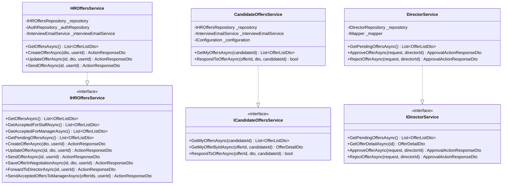
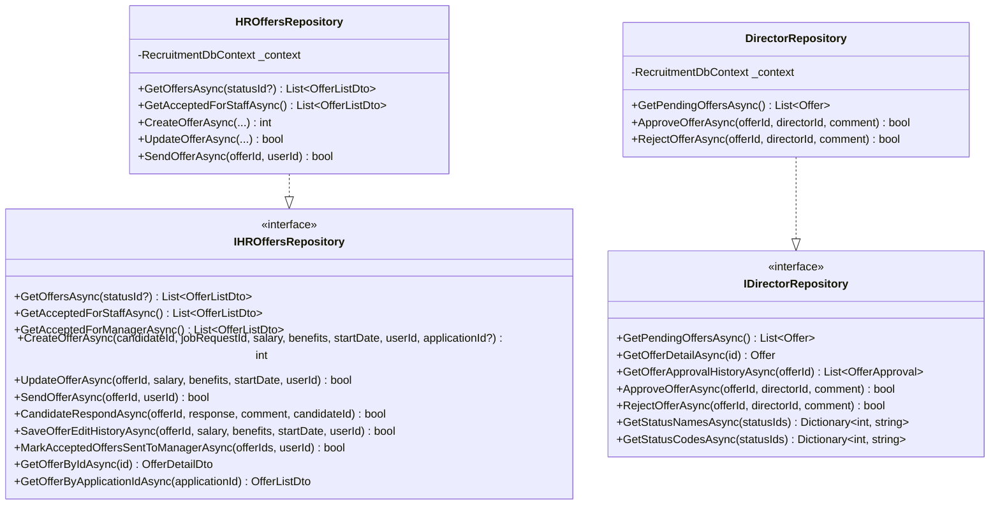
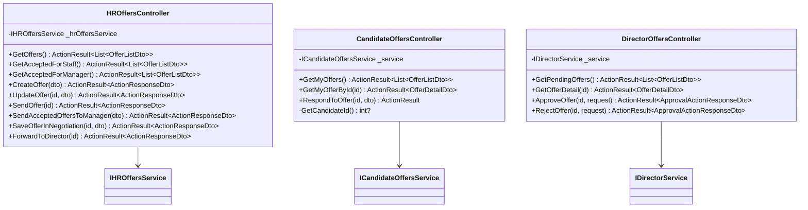
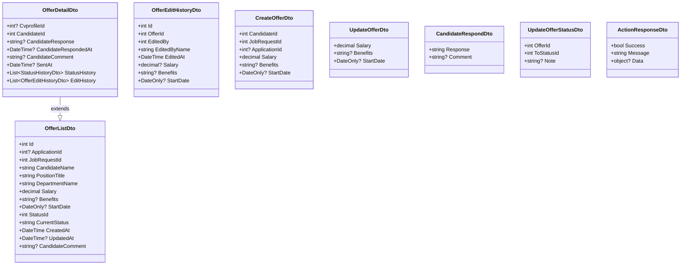
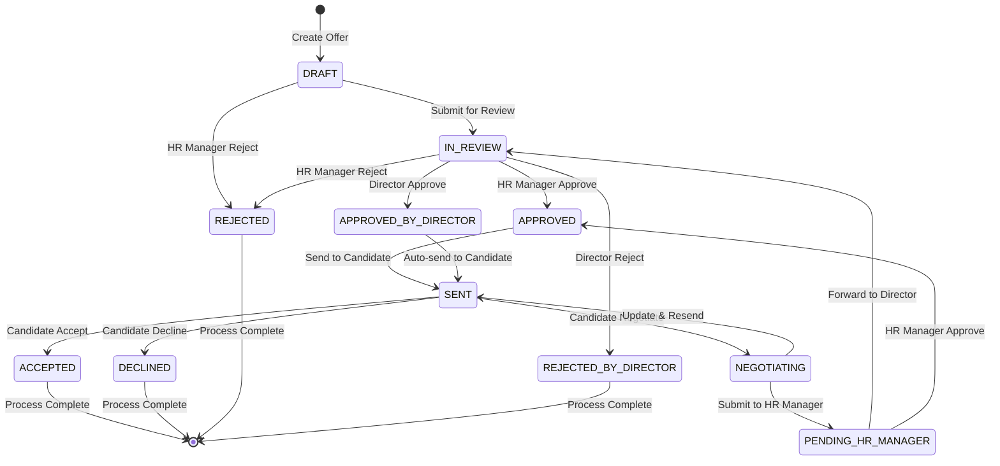

# Offer Workflow Class Diagram

## 1. Core Entities - Offer Domain

```mermaid
classDiagram
    class Offer {
        +int Id
        +int? ApplicationId
        +int? CandidateId
        +int? JobRequestId
        +decimal? ProposedSalary
        +string? Benefits
        +DateOnly? StartDate
        +int StatusId
        +int CreatedBy
        +DateTime? CreatedAt
        +DateTime? UpdatedAt
        +int? UpdatedBy
        +string? CandidateResponse
        +string? CandidateComment
        +DateTime? CandidateRespondedAt
        +DateTime? SentAt
        +DateTime? SentToManagerAt
        +bool? IsDeleted
    }

    class OfferApproval {
        +int Id
        +int OfferId
        +int ApproverId
        +string Decision
        +string? Comment
        +DateTime? ApprovedAt
    }

    class OfferEditHistory {
        +int Id
        +int OfferId
        +int EditedBy
        +DateTime EditedAt
        +decimal? Salary
        +string? Benefits
        +DateOnly? StartDate
    }

    class Status {
        +int Id
        +int StatusTypeId
        +string Code
        +string Name
        +int? OrderNo
        +bool? IsFinal
    }

    class StatusHistory {
        +int Id
        +int EntityTypeId
        +int EntityId
        +int? FromStatusId
        +int ToStatusId
        +int ChangedBy
        +DateTime? ChangedAt
        +string? Note
    }

    class WorkflowTransition {
        +int Id
        +int StatusTypeId
        +int FromStatusId
        +int ToStatusId
        +int RequiredRoleId
    }

    Offer ||--o{ OfferApproval : "has approvals"
    Offer ||--o{ OfferEditHistory : "has edit history"
    Offer }o--|| Status : "current status"
    StatusHistory }o--|| Status : "from/to status"
    WorkflowTransition }o--|| Status : "from/to status"
```

## 2. Related Entities - Application & Candidate Domain

```mermaid
classDiagram
    class Application {
        +int Id
        +int JobRequestId
        +int CvprofileId
        +int StatusId
        +int Priority
        +DateTime? AppliedAt
        +DateTime? UpdatedAt
        +int? UpdatedBy
        +bool? IsDeleted
        +int NoShowCount
    }

    class Candidate {
        +int Id
        +string FullName
        +string Email
        +string? Phone
        +DateTime? CreatedAt
        +int? CreatedBy
        +bool? IsDeleted
        +string? PasswordHash
        +string? GoogleId
        +string AuthProvider
        +string? AvatarUrl
    }

    class Cvprofile {
        +int Id
        +int CandidateId
        +string FullName
        +string? Email
        +string? Phone
        +string? Summary
        +int? YearsOfExperience
        +string? Source
        +DateTime? CreatedAt
        +string? CvFileUrl
        +string? Address
        +string? ProfessionalTitle
        +string? SkillsText
        +string? ReferencesText
    }

    class JobRequest {
        +int Id
        +int PositionId
        +int RequestedBy
        +int Quantity
        +int StatusId
        +int Priority
        +decimal? Budget
        +string? Reason
        +DateOnly? ExpectedStartDate
        +DateTime? CreatedAt
        +int? CreatedBy
        +DateTime? UpdatedAt
        +int? UpdatedBy
        +bool? IsDeleted
        +int? AssignedStaffId
    }

    class Position {
        +int Id
        +string Title
        +int DepartmentId
        +DateTime? CreatedAt
        +int? CreatedBy
        +bool? IsDeleted
    }

    class Department {
        +int Id
        +string Name
        +int? HeadUserId
        +DateTime? CreatedAt
        +int? CreatedBy
        +bool? IsDeleted
    }

    Application }o--|| JobRequest : "applies to"
    Application }o--|| Cvprofile : "uses CV"
    Cvprofile }o--|| Candidate : "belongs to"
    JobRequest }o--|| Position : "for position"
    Position }o--|| Department : "in department"
```

## 3. User & Role Domain

```mermaid
classDiagram
    class User {
        +int Id
        +string FullName
        +string Email
        +bool? IsActive
        +DateTime? CreatedAt
        +int? CreatedBy
        +DateTime? UpdatedAt
        +int? UpdatedBy
        +bool? IsDeleted
        +string? PasswordHash
        +string? GoogleId
        +string AuthProvider
        +string? AvatarUrl
    }

    class Role {
        +int Id
        +string Code
        +string Name
        +int? ParentRoleId
    }

    class UserDepartment {
        +int UserId
        +int DepartmentId
        +bool? IsPrimary
        +DateOnly? JoinedAt
        +DateOnly? LeftAt
    }

    User }o--o{ Role : "has roles"
    User ||--o{ UserDepartment : "assigned to"
    UserDepartment }o--|| Department : "department"
    Role ||--o{ Role : "parent role"
```

## 4. Service Layer



## 5. Repository Layer



## 6. Controller Layer



## 7. DTO Classes



## 8. Complete Relationships Overview

```mermaid
classDiagram
    class Offer {
        +int Id
        +int? ApplicationId
        +int? CandidateId
        +int? JobRequestId
        +int StatusId
    }

    class Application {
        +int Id
        +int JobRequestId
        +int CvprofileId
    }

    class Candidate {
        +int Id
        +string FullName
    }

    class JobRequest {
        +int Id
        +int PositionId
        +int RequestedBy
    }

    class Position {
        +int Id
        +int DepartmentId
    }

    class Department {
        +int Id
        +string Name
    }

    class User {
        +int Id
        +string FullName
    }

    class Status {
        +int Id
        +string Name
    }

    class OfferApproval {
        +int OfferId
        +int ApproverId
    }

    class OfferEditHistory {
        +int OfferId
        +int EditedBy
    }

    Offer }o--o| Application : "linked to"
    Offer }o--o| Candidate : "for candidate"
    Offer }o--o| JobRequest : "fulfills"
    Offer }o--|| Status : "has status"
    Offer ||--o{ OfferApproval : "approved by"
    Offer ||--o{ OfferEditHistory : "edit history"

    Application }o--|| JobRequest : "applies to"
    Application }o--|| Cvprofile : "uses CV"
    Cvprofile }o--|| Candidate : "belongs to"

    JobRequest }o--|| Position : "for position"
    JobRequest }o--|| User : "requested by"
    Position }o--|| Department : "in department"

    OfferApproval }o--|| User : "approved by"
    OfferEditHistory }o--|| User : "edited by"
```

## 9. Offer Status State Diagram

