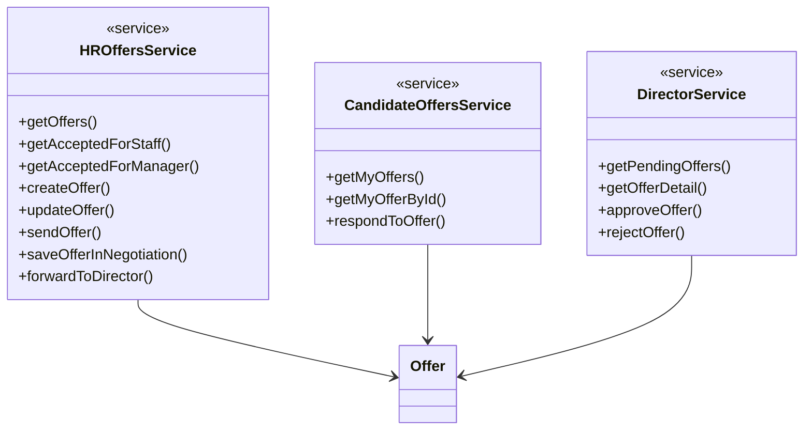
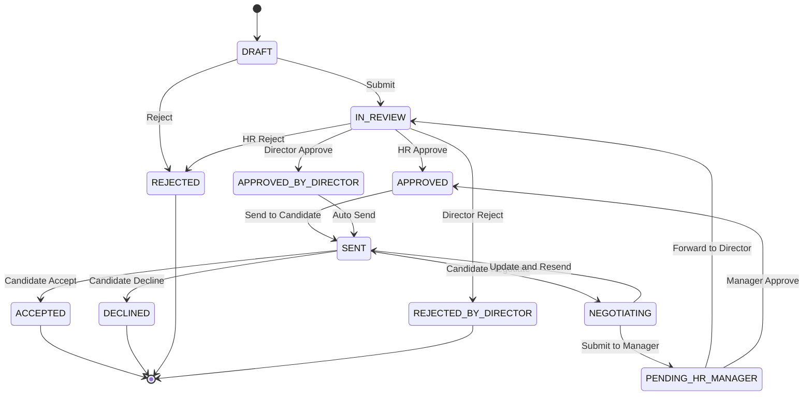
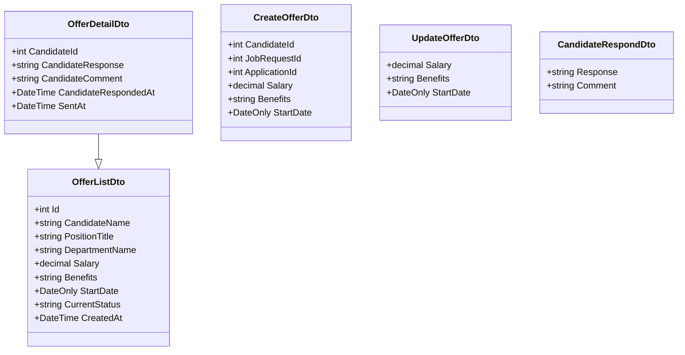

# Offer Workflow - Mermaid Class Diagram (Simplified)

## 1. Core Offer Entities

```mermaid
classDiagram
    class Offer {
        +int Id
        +int ApplicationId
        +int CandidateId
        +int JobRequestId
        +decimal ProposedSalary
        +string Benefits
        +DateOnly StartDate
        +int StatusId
        +string CandidateResponse
        +string CandidateComment
        +DateTime SentAt
        +DateTime SentToManagerAt
    }

    class OfferApproval {
        +int Id
        +int OfferId
        +int ApproverId
        +string Decision
        +string Comment
        +DateTime ApprovedAt
    }

    class OfferEditHistory {
        +int Id
        +int OfferId
        +int EditedBy
        +DateTime EditedAt
        +decimal Salary
        +string Benefits
        +DateOnly StartDate
    }

    class Status {
        +int Id
        +string Code
        +string Name
        +int OrderNo
        +bool IsFinal
    }

    Offer ||--o{ OfferApproval
    Offer ||--o{ OfferEditHistory
    Offer }o--|| Status
```

## 2. Related Entities

```mermaid
classDiagram
    class Application {
        +int Id
        +int JobRequestId
        +int CvprofileId
        +int StatusId
        +DateTime AppliedAt
        +int Priority
    }

    class Candidate {
        +int Id
        +string FullName
        +string Email
        +string Phone
        +string AuthProvider
    }

    class Cvprofile {
        +int Id
        +int CandidateId
        +string FullName
        +string Email
        +string Phone
        +string Summary
        +int YearsOfExperience
    }

    class JobRequest {
        +int Id
        +int PositionId
        +int RequestedBy
        +int AssignedStaffId
        +int Quantity
        +int StatusId
        +decimal Budget
        +DateOnly ExpectedStartDate
    }

    class Position {
        +int Id
        +string Title
        +int DepartmentId
    }

    class Department {
        +int Id
        +string Name
        +int HeadUserId
    }

    Application }o--|| JobRequest
    Application }o--|| Cvprofile
    Cvprofile }o--|| Candidate
    JobRequest }o--|| Position
    Position }o--|| Department
```

## 3. User & Role System

```mermaid
classDiagram
    class User {
        +int Id
        +string FullName
        +string Email
        +bool IsActive
        +string AuthProvider
    }

    class Role {
        +int Id
        +string Code
        +string Name
        +int ParentRoleId
    }

    class UserDepartment {
        +int UserId
        +int DepartmentId
        +bool IsPrimary
        +DateOnly JoinedAt
    }

    User }|--|{ Role
    User ||--o{ UserDepartment
    UserDepartment }o--|| Department
```

## 4. Service Layer



## 5. Controller Layer

```mermaid
classDiagram
    class HROffersController {
        <<controller>>
        +GET /offers
        +GET /accepted-for-staff
        +GET /accepted-for-manager
        +POST /offers
        +PUT /offers/{id}
        +PUT /offers/{id}/send
        +POST /send-accepted-to-manager
    }

    class CandidateOffersController {
        <<controller>>
        +GET /offers
        +GET /offers/{id}
        +PUT /offers/{id}/respond
    }

    class DirectorOffersController {
        <<controller>>
        +GET /pending
        +GET /{id}
        +POST /{id}/approve
        +POST /{id}/reject
    }

    HROffersController --> HROffersService
    CandidateOffersController --> CandidateOffersService
    DirectorOffersController --> DirectorService
```

## 6. Complete Relationships

```mermaid
classDiagram
    class Offer {
        +int Id
        +int ApplicationId
        +int CandidateId
        +int JobRequestId
        +int StatusId
    }

    class Application {
        +int Id
        +int JobRequestId
        +int CvprofileId
    }

    class Candidate {
        +int Id
        +string FullName
    }

    class JobRequest {
        +int Id
        +int PositionId
    }

    class Position {
        +int Id
        +string Title
    }

    class User {
        +int Id
        +string FullName
    }

    class Status {
        +int Id
        +string Name
    }

    class OfferApproval {
        +int OfferId
        +int ApproverId
    }

    Offer }o--o| Application
    Offer }o--o| Candidate
    Offer }o--o| JobRequest
    Offer }o--|| Status
    Offer ||--o{ OfferApproval

    Application }o--|| JobRequest
    JobRequest }o--|| Position
    OfferApproval }o--|| User
```

## 7. Offer Status Flow



## 8. DTO Structure



## Key Points for Mermaid Syntax:

1. **Class Definition**: Use `class ClassName { }`
2. **Attributes**: Use `+type attributeName` or `+attributeName`
3. **Methods**: Use `+methodName()` or `+methodName(params)`
4. **Relationships**: 
   - One-to-One: `||--||`
   - One-to-Many: `||--o{`
   - Many-to-One: `}o--||`
   - Many-to-Many: `}|--|{`
5. **Inheritance**: `ChildClass --|> ParentClass`
6. **Dependency**: `ClassA --> ClassB`
7. **Stereotypes**: Use `<<stereotype>>`

## Status IDs Reference:
- DRAFT: 14
- IN_REVIEW: 15  
- APPROVED: 18
- SENT: 16
- ACCEPTED: 19
- NEGOTIATING: 21
- PENDING_HR_MANAGER: 24
- REJECTED: 17
- DECLINED: 20
- APPROVED_BY_DIRECTOR: 22
- REJECTED_BY_DIRECTOR: 23